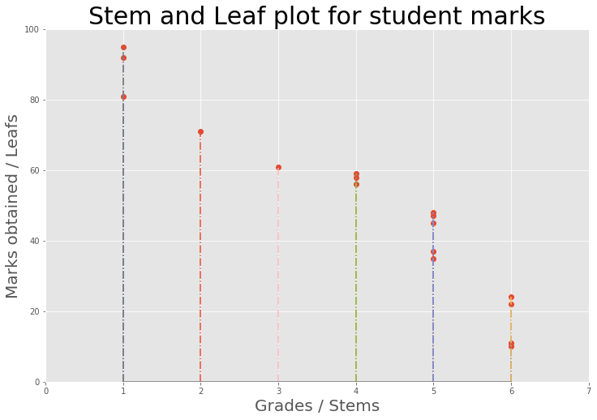
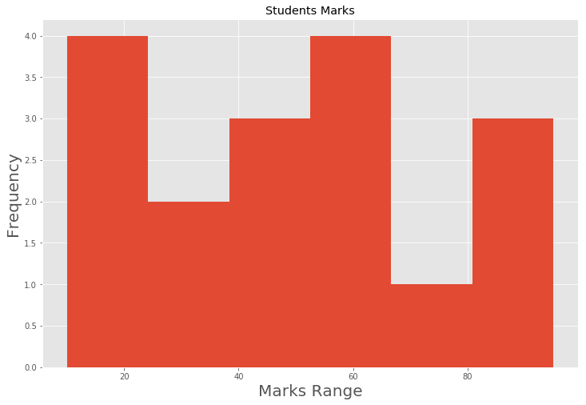

# Statistical Distributions with Stem and Leaf Plots - Lab

## Introduction

In this lab, you'll be able to practice your stem and leaf plots knowledge.


## Objectives

* Create stem and leaf plots from given data in matplotlib
* Compare effectiveness of stem plots as compared to histograms

## Analyzing Students Results

Following is list of marks that students obtained in a certain project (out of 100). You can clearly see that there is quite a huge spread in the data reflecting a range of numbers going from 10 to 95. 

```
10,11,22,24,35,37,45,47,48,58,56,59,61,71,81,92,95
```


We would like to give grades to these students using a very naive criteria:
* Anything below 30 is a Fail
* 30 - 50 is a Referral for repeating the project
* 5 - 59 is a Pass
* 60 - 69 is a Merit
* 70 - 79 is a Distinction
* 80+ is a high distinction

Once the criteria is established, we would like to see how many students fall in each of these classes/grades using a visual approach.

We shall go ahead and build a stem and leaf plot for this data. This plot would help us visualize above grading classes and how many students fall in each class.

## Let's get started 
First lets import necessary libraries. We would need numpy for processing data and matplotlib for visualizations. 


```python
import matplotlib.pyplot as plt
import numpy as np
plt.style.use('ggplot')
```

First we need to make a numpy array containing all of those above values.


```python
marks = np.array([10,11,22,24,35,37,45,47,48,58,56,59,61,71,81,92,95])
marks

# array([10, 11, 22, 24, 35, 37, 45, 47, 48, 58, 56, 59, 61, 71, 81, 92, 95])
```


    array([10, 11, 22, 24, 35, 37, 45, 47, 48, 58, 56, 59, 61, 71, 81, 92, 95])


## Create classes from data

With above data, we can develop a stem and leaf plot in a multutude of ways, 

In order to create stems, let's give above marks a grade as below'

* Less than 30 is Grade 6
* 30 - 50 is Grade 5
* 51 - 59 is Grade 4
* 60 - 69 is Grade 3
* 70 - 79 is Grade 2
* 80+ is Grade 1

We can now go ahead and create stems from grades. Perform following steps:

* Create a an empty list for storing grades (stems)
* For each element in marks, save the respective rank value (1-6) in the list. (Hint: Use if-elif-if while iterating through marks)

>Note : For stem and leaf plots, values in stem array **MUST** be equal to values in leaves array. 


```python
# Create a stems array to store the grades for all the marks in marks array, in the same order.
stems = []
for mark in marks:
    if mark < 30:
        stems.append(6)
    elif mark >= 30 and mark <50:
        stems.append(5)
    elif mark >= 50 and mark <60:
        stems.append(4)
    elif mark >= 60 and mark <70:
        stems.append(3)
    elif mark >= 70 and mark <80:
        stems.append(2)
    else:
        stems.append(1)
stems

# [6, 6, 6, 6, 5, 5, 5, 5, 5, 4, 4, 4, 3, 2, 1, 1, 1]
```


    [6, 6, 6, 6, 5, 5, 5, 5, 5, 4, 4, 4, 3, 2, 1, 1, 1]


Thats great, we can use our stems(grades) and leaves(marks) for visualizing a stem and leaf plot.

##  Using `pyplot.stem()` 

the pyplot module in matplotlib comes packaged with a `.stem()` method for visualizing stem and leaf plots. Heres a general syntax for calling this method
```python
plt.stem(x=stems, y=leaves, linefmt, markerfmt, basefmt)
```
And [here is the official documentation](https://matplotlib.org/api/_as_gen/matplotlib.pyplot.stem.html) if you want to dig deeper for customizations. We shall simply pass the stem(grades) and leaves(marks) arrays to this function with some simple formatting to visualize the plot. Perform following tasks:

* Set a figure size of 12 x 8
* Use `.stem()` and pass in required arguments to plot
* Set suitable limits for x and y - axis 
* Apply label and axes formatting 
* Show the final output


```python
# Create a stem and leaf plot with above data

plt.figure(figsize=(12,8))
markerline, stemlines, baseline = plt.stem(stems, marks, '-.', 'o' )

plt.xlim([0,7])
plt.ylim([0,100])
plt.title('Stem and Leaf plot for student marks', fontsize = 30 )
plt.ylabel('Marks obtained / Leafs', fontsize = 20)
plt.xlabel('Grades / Stems', fontsize = 20)

plt.show()
```





## Analyzing the output
So there we have it, our stem and leaf plot. We can quickly visualize the range of each class, through length of the stem (dotted lines) along with markers indicating individual values. We can also visualize how many students exist in each class. This helps us get a better insight of the data in hand.

Just to get a bit more intuition behind this, let's build a histogram and compare both plots. Let's split this in 6 bins by passing the values matching our ranks. Its always a good idea to label and title your plots. 


```python
# Create a histogram for marks

plt.figure(figsize=(12,8))
plt.hist(marks, bins=6);
plt.ylabel('Frequency', fontsize = 20)
plt.xlabel('Marks Range', fontsize = 20)
plt.title('Students Marks')
```


    Text(0.5,1,'Students Marks')





Not **AS** revealing as the stem and leaf plot, right? You can probably play around a bit with bin size to make it a bit more revealing. 

As we saw before, we can get an idea about the placement frequency  of marks in a certain class/grade, but theres no way to see individual values. For an indepth analysis, it is highly recommended to use the appropriate plotting style to have a clear understanding of underlying data. 

## Level Up (Optional)

Let's customize our stem and leaf plot a bit more to show high distinction , distinction , merit, pass and fail, instead of numbers from 1 - 6. You would need to create labels and pass it to `xticks()` attribute of the plot object to achieve this. 

## Summary

In this lab, we saw how to create stem and leaf plot using matplot lib. We saw all the necessary steps required to create classes and placing respective values inside the classes for plotting using `.stem()` method. We also re-enforced the idea that these plots could be more insightful than histograms in some cases. In the upcoming labs, we shall talk about other statistical visualizations to dive deeper into the distributions.
